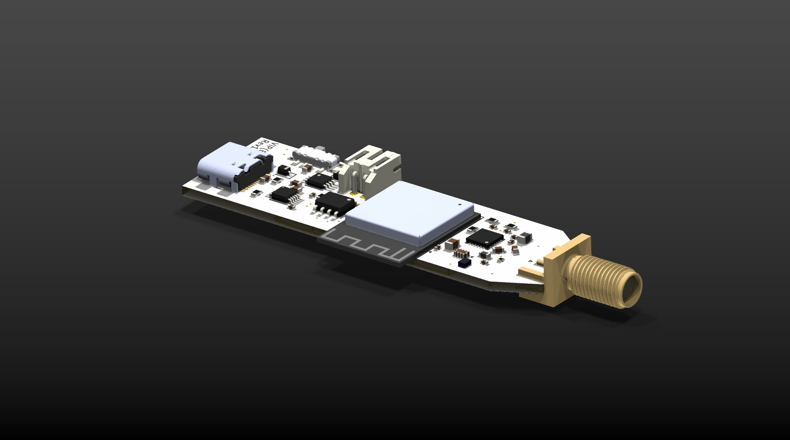

# What is VIPR?

Simply put, VIPR is a open source radio node designed and built around North American mesh communication over LoRa built off of an ESP32-S3 platform. Put less simply, VIPR is another ESP32 development board focused more on frontend, hardware, and size. The project aims to create a small, pocketable radio node that can run independently. Currently the procsessing power of it's latest version (2.0) can only handle small workloads and can only run a Real Time OS in comparison to a fully fledged computer.

**VIPR is currently in Alpha testing, soon to be beta!**

## Current Revision



Currently the board packs a 19mm wide footprint without a screen. The end is equipped with an SMA conector for easy antenna swaps and the side boasts an onboard PCB wifi antenna tied to the ESP32-MINI-1 module.

Future revisions intend to add a screen and interactives to the board to further refine the frontend, all that is needed after that is software and a case!

### Changelog

```
* Redid a proper BOM
    * This included sizing and components selection
* Added back the CH340X
* Reverted to old "pen" form factor
* Created a new "lopsided" board end 
```

## Docs

Docs will be coming soon!
<br>

#### Latest Journal as of July 28th

>I just finished rev2 for the board! What's new?
>
>I fixed the issue of all the passive components being 0402 metric then I decided to learn about >how to pick the correct sizes for each component.
>
>The CH340X is back in the board to allow USB serial and I'm thinking about adding JTAG headers to >the board for debugging.
>
>I went back to the pen form factor and also am considering adding a screen to the board.
>
>There will be not more motive changes for now and the project will stay like this.
>
>I'm going to continue to work on this and I think I'm going to get this produced
>
>-Matias
