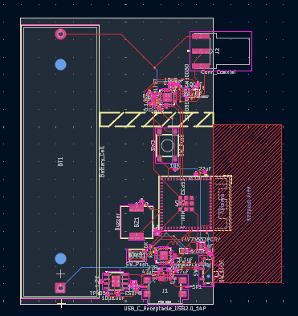
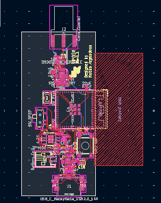
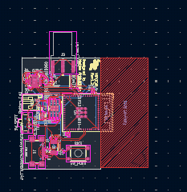

# July 6th: Second revision

Today I redid the board again, following my normal routine redo to get the size smaller and smaller.

Rev1 was large and rev1.1 adopted a stick like shape while rev1.2 got wider by around 2 mm but a lot shorter.  

 
As seen here Revision one is very big, with that LiPo holder on board a lot of the footprint is dedicated to that and that only. Making it very clunky for it's intended purpose.  

 
Revision 1.1 fixes this by adding a two pin JST connector to save space with the added complexity of now needing to find the correct battery and tuning the board for it. And also the extra connectors adds more complexity requiring another component to be on the edge.   

 
Revision 1.2 fixes the issue of the USB serial chip and mitigates a possible manufacturing issue considering the chip used (FTDI FT231XQ) is outdated and expesive. To combat this I replaced the old IC with a new CH340X that has less pins and an arguably easier to work with MSOP-10 package. The package does come with gullwing pins, now most people would think of this as a size increase but considering my (questionable) soldering skills I consider it a pro.  

So far the project seems to be going good, I think I'm going to split this repo for different models of VIPER. See you!  

-Matias =)

[Total time spent: 48 mins]

# July 22nd: Brushing dust off this

I'm running up to add an addon system for the device and some dedicated pins to do so. as getting this from another really cool project called pocketbyte, go check it out!

I changed all of the LEDs to soft switches instead because i felt it looked nice.

I'm currently going to source a ref for the pinout soon. But It's going good.

- Matias

# July 28th

I just finished rev2 for the board! What's new?

I fixed the issue of all the passive components being 0402 metric then I decided to learn about hwo to pick the correct sizes for each component.

The CH340X is back in the board to allow USB serial and I'm thinking about adding JTAG headers to the board for debugging.

I went back to the pen form factor and also am considering adding a screen to the board.

There will be not more motive changes for now and the project will stay like this.

I'm going to continue to work on this and I think I'm going to get this produced
